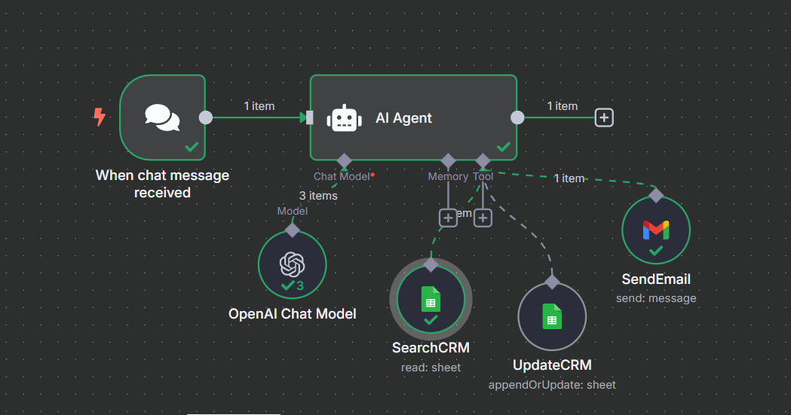
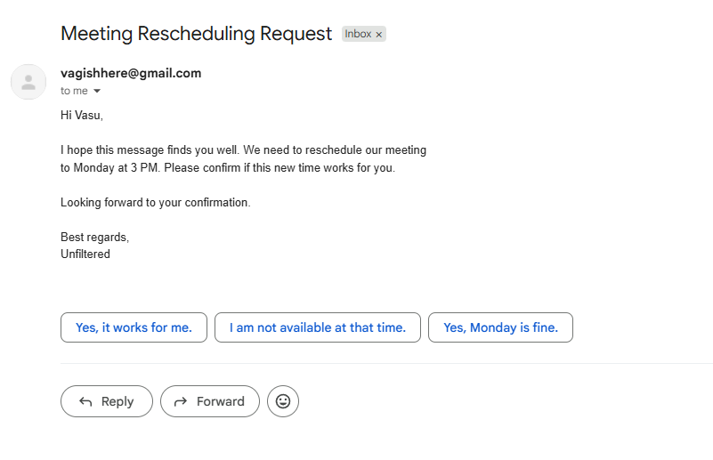

# 🤖 AI-Powered CRM Assistant using n8n

This is a smart automation workflow built with [n8n.io](https://n8n.io) that simulates a real-world CRM assistant for business strategy, sales, or operations teams.

It leverages OpenAI to understand tasks, updates CRM records stored in Google Sheets, and sends contextual emails automatically.

---

## 🧩 Features

- 🧠 Uses OpenAI Chat model for intelligent responses
- 📁 Reads & updates CRM data from Google Sheets
- 📧 Sends follow-up or meeting emails via Gmail
- 💬 Responds to messages like:  
  _"Send follow-up to Ramesh. Reschedule meeting to Monday 3pm"_

---

## 📸 Screenshots

  
*The full automation workflow in n8n cloud*

  
*Automated email task with confirmation message*

---

## 🛠️ Tech Stack

| Tool      | Use Case                         |
|-----------|----------------------------------|
| n8n       | Automation workflow builder      |
| OpenAI    | Chat model for instructions      |
| Google Sheets | CRM system (search/update)  |
| Gmail     | Send emails                      |

---

## 📦 Setup & How It Works

1. **Trigger**: Waits for a text message (manual or webhook)
2. **AI Agent**: Sends message to OpenAI (ChatGPT 3.5)
3. **Google Sheet Search**: Finds matching CRM record
4. **Google Sheet Update**: Updates status or logs task
5. **Gmail**: Sends a generated follow-up email
6. **Response**: Confirms task completion in chat

---

## 🧪 Example Input & Output

**Input Message:**  
Send an email to Vasu to reschedule meeting to Monday 3 PM. Ask for confirmation.

**AI Output:**  
Email sent to Vasu to reschedule. Waiting for his confirmation. Anything else?

---

## 📂 Exported Workflow

You can find the full exported n8n JSON file in [workflow.json](emailsending.json)

To import:
- Open n8n
- Go to "Workflows" → "Import" → Upload this file

---

## 💡 Why This Project

This project demonstrates:
- Workflow automation
- AI-driven productivity tools
- CRM integration
- Smart task delegation — **core skills for a Business Strategy Intern**

---

## 👤 Author

[Vagish Bhardwaj](https://www.linkedin.com/in/vagish-bhardwaj-115089252)

